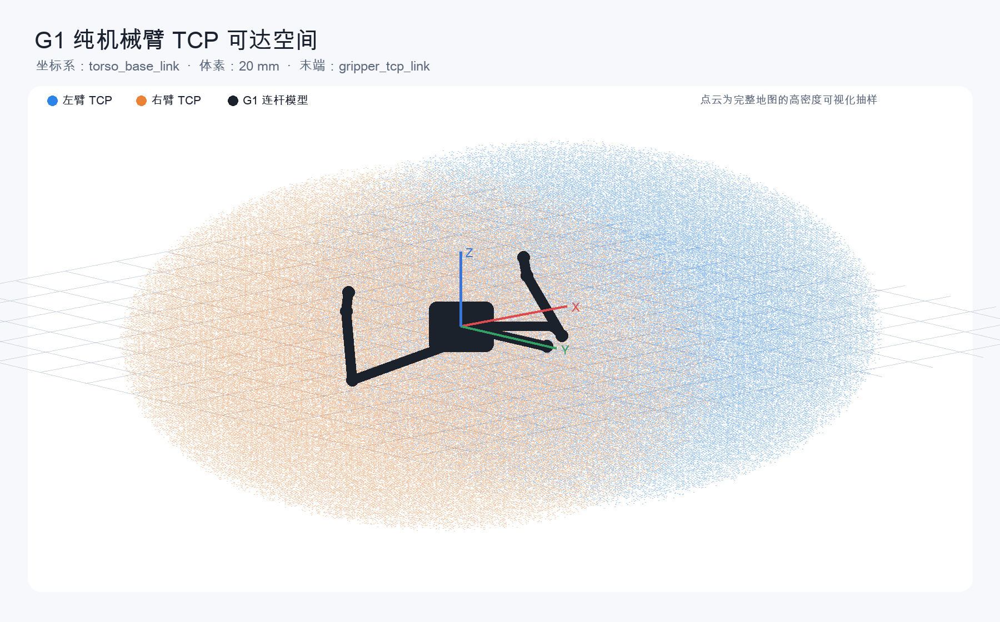
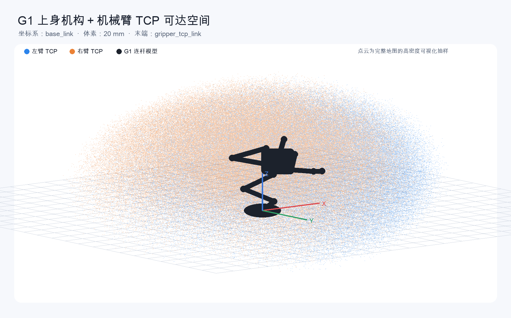
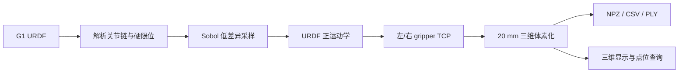

# Galbot G1 Robot Arm Reachability Model

银河通用 G1 双臂机器人末端可达空间建模工具与实机采样结果。项目基于机器人官方 URDF 关节限位，通过 Sobol 低差异序列采样和 URDF 正运动学，把左右夹爪 TCP 的连续可达空间转换为 20 mm 三维体素点云。

> 这是离线建模工具，代码不导入 Galbot SDK，不会向机器人发送任何运动指令。

## 三维结果

### 纯机械臂可达空间

只改变一侧 7 个手臂关节，上身机构不纳入采样。点云坐标相对 `torso_base_link`，适合研究手臂本身的可达包络。



### 上身机构＋机械臂可达空间

同时采样 5 个 `leg_joint` 和单侧 7 个手臂关节，点云坐标相对 `base_link`。它反映底盘固定时，上身调节与手臂联合可以覆盖的运动学空间。



蓝色为左臂 TCP，橙色为右臂 TCP，黑色为从 URDF 关节链计算得到的 G1 连杆模型。图像为高密度显示抽样，仓库中的 NPZ 保留完整体素。

## 实机生成结果

2026-09-07 在 G1 v2.2.1 机器人上完成了每张地图 1,048,576 个关节样本的计算：

| 地图 | 坐标系 | 采样自由度 | 占用体素 | X 范围 (m) | Y 范围 (m) | Z 范围 (m) |
| --- | --- | ---: | ---: | --- | --- | --- |
| 纯左臂 | `torso_base_link` | 7 | 323,874 | -0.41 … 1.17 | -0.79 … 1.13 | -0.97 … 0.97 |
| 纯右臂 | `torso_base_link` | 7 | 323,844 | -1.17 … 0.41 | -0.79 … 1.13 | -0.97 … 0.97 |
| 整机左臂 | `base_link` | 12 | 647,536 | -1.93 … 1.77 | -0.97 … 1.19 | -1.09 … 2.31 |
| 整机右臂 | `base_link` | 12 | 647,209 | -1.99 … 1.79 | -1.19 … 0.95 | -1.09 … 2.31 |

上表范围是体素中心的轴对齐包围盒，**不代表包围盒内部每个位置都可达**。请使用 NPZ 地图或查询工具判定具体点位。

## 建模方法



1. 从 URDF 建立 `base frame → gripper_tcp_link` 关节链。
2. 按 URDF `lower` / `upper` 硬限位把 Sobol 样本映射到关节空间。
3. 使用 `T_parent_child(q) = T_origin · T_axis(q)` 逐关节计算 TCP 位置。
4. 按 `floor(position / voxel_size)` 体素化并去重。
5. 每个体素保存一组能落入该体素的代表关节角。

连续三维空间包含无限多个点，因此“所有点位”必须表示为指定分辨率下的体素近似。提高 `--sample-power` 和减小 `--voxel-mm` 可以获得更精细的地图。

## 仓库结构

```text
.
├── data/
│   ├── arm-only_left_020mm.npz
│   ├── arm-only_right_020mm.npz
│   ├── whole-body_left_020mm.npz
│   ├── whole-body_right_020mm.npz
│   ├── robot_segments.json
│   └── summary.json
├── docs/
│   ├── images/
│   └── viewer.html
├── src/
│   ├── build_reachability.py
│   ├── query_reachability.py
│   └── render_static.py
├── README.md
└── requirements.txt
```

## 快速开始

### 1. 在 G1 机器人上生成地图

机器人环境已包含 NumPy 和 SciPy 时：

```bash
git clone https://github.com/tree1129/Galbot_Robot_ARM_SpacePoint_Modle.git
cd Galbot_Robot_ARM_SpacePoint_Modle

python src/build_reachability.py \
  --urdf /home/galbot/vla_client/vla_tree/galbot_one_golf_description/urdf/galbot_g1_v2_2_1.urdf \
  --output reachability_output \
  --mode both \
  --arm both \
  --sample-power 20 \
  --voxel-mm 20
```

每臂采样数为 `2**sample_power`。例如：

- `--sample-power 20`：1,048,576 样本/地图；
- `--sample-power 22`：4,194,304 样本/地图，适合 10 mm 体素；
- `--joint-margin-deg 2`：在 URDF 硬限位内侧额外留出 2° 边界。

### 2. 查询具体点位

例如查询整机右臂在 `base_link` 坐标系中的 `(0.60, -0.30, 1.00)` m：

```bash
python src/query_reachability.py \
  data/whole-body_right_020mm.npz \
  0.60 -0.30 1.00
```

返回 JSON 包含：

- `reachable_within_tolerance`：是否落在已采样体素容差内；
- `nearest_voxel_center_m`：最近体素中心；
- `distance_m`：查询点与体素中心的距离；
- `representative_q_rad`：该体素的一组代表关节角；
- `joint_names`：与关节角一一对应的关节名。

退出码 `0` 表示落在已采样体素内，`1` 表示没有。

### 3. 交互式三维查看

下载仓库后用浏览器打开 `docs/viewer.html`。查看器支持：

- 纯机械臂/上身机构＋机械臂地图切换；
- 左臂、右臂和机器人模型独立显隐；
- 鼠标旋转、缩放和平移；
- TCP 点大小调节。

如果浏览器禁止直接加载本地 HTML，可在仓库根目录运行：

```bash
python -m http.server 8000
```

然后打开 `http://127.0.0.1:8000/docs/viewer.html`。

### 4. 重新生成 README 图片

```bash
python src/render_static.py
```

## NPZ 数据格式

| 字段 | 形状 | 含义 |
| --- | --- | --- |
| `voxel_indices` | `(N, 3)` | 三维有符号体素索引 |
| `centers_m` | `(N, 3)` | 体素中心，单位 m |
| `sample_count` | `(N,)` | 落入该体素的关节样本数 |
| `representative_q_rad` | `(N, DoF)` | 一组代表关节角，单位 rad |
| `joint_names` | `(DoF,)` | 关节角对应的 URDF 关节名 |
| `voxel_size_m` | scalar | 体素边长，单位 m |
| `base_frame` | scalar string | 坐标基准帧 |
| `tip_frame` | scalar string | TCP 末端帧 |

## 验证

- 建模正运动学与机器人环境中的 Pinocchio 对 50 组随机配置交叉验证，最大位置误差约 `1.05×10⁻¹⁵ m`。
- 每张地图抽取 101 个代表关节配置重新计算 FK，各坐标轴误差均小于半个体素（`10 mm`）。
- 数据使用的 URDF SHA-256：`8a49fd3d1a3ba559d5d50d26a05f6d866e1716d131c5c46a81d3074638dce43c`。

## 限制与安全边界

当前地图是**关节限位内的运动学可达集**，不是可直接执行的运动规划结果。它没有过滤：

- 机器人自碰撞和夹爪/躯干碰撞；
- 地面、桌椅、墙体、人体等真实场景障碍物；
- 末端姿态、负载、力矩、线缆和热限制；
- 从当前关节状态到目标点的连续无碰路径。

整机地图使用 URDF 中全部硬限位，因此包含实机规划器可能因自碰或地面碰撞而拒绝的极端配置。

**不要把点云中的某个点直接作为真机运动许可。** 真机执行前必须使用厂商规划器完成逆解、全路径碰撞检查、速度/力矩约束和现场急停验证。
