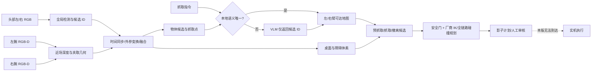

# G1 双相机快速抓取架构（影子模式）

## 结论

把快速、准确和安全分开：本地视觉与深度负责几何，可达地图负责快速剔除不可达点，厂商规划器负责完整连杆避障。`gpt-5.6-terra` 仅在“那个杯子”之类指令有歧义时从候选 ID 中做语义选择，不输出坐标、不生成轨迹、不能越过安全门。



## 数据流与延迟目标

| 阶段 | 输入 | 输出 | 设计预算 |
| --- | --- | --- | ---: |
| 头部检测 | 双目 RGB | 物体 mask/bbox/ID | 30–80 ms（本地 GPU） |
| 腕部精定位 | RGB + D405 depth | `base_link` 中心/尺寸 | 20–50 ms |
| 可达性查询 | 抓取点 + 20 mm NPZ | 左/右臂候选 | <5 ms（内存索引） |
| 末端通道预检 | 障碍 AABB/体素 | 阻塞 ID | 5–20 ms |
| VLM 语义门 | 低清场景图 + 候选表 | 唯一 candidate ID | 仅歧义时，1.8 s 超时 |
| 厂商规划器 | 预抓取姿态 + 全障碍 | 无碰轨迹 | 上线阶段接入 |

常见指令如“抓取苹果”通过本地 label 直接进入几何规划，不请求大模型。只有多个候选都可能匹配时才调用 VLM；超时、低置信度、返回非法 ID 都会停在 `NEEDS_SEMANTIC_REVIEW`。

当前本机 replay 实测：左右两张完整体素地图一次性加载约 `157 ms`，预热后 500 次确定性计划平均 `0.45 ms/次`。这是纯规划层基准，不包括检测网络、相机传输和厂商全轨迹规划。
规划核心同时在 G1 的 Python 3.8 / ARM64 / NumPy 1.24 环境通过全部测试。

## 坐标与相机

- 所有抓取点和障碍都在 `base_link` 中表示，与整机可达地图一致。
- G1 SDK 提供 `HEAD_LEFT_CAMERA` / `HEAD_RIGHT_CAMERA`、左右腕 RGB 和 `LEFT/RIGHT_ARM_DEPTH_CAMERA`。
- 每帧必须附带硬件时间戳，用 SDK 外参变换到 `base_link`；头部/腕部估计相差超过 40 mm 则拒绝融合。
- 头部相机管全局搜索和障碍更新；最后 15–25 cm 接近使用同侧腕部深度闭环修正。

## 安全门

以下任一条会失败关闭，不产生可执行计划：

- 相机帧超过 180 ms，或机器人关节状态不新鲜；
- 手眼标定残差大于 12 mm；
- 场景深度覆盖低于 75%，或目标深度覆盖低于 80%；
- 1 m 范围内检测到人，或急停不可用；
- 抓取点/预抓取点不在可达体素内；
- 55–70 mm 末端安全廊道被其他物体占用；
- VLM 异常、超时、低信心或越过 candidate allow-list。

现有 NPZ 是运动学体素，不是无碰轨迹。实机阶段必须二次调用 Galbot 规划服务，开启碰撞检查，并在低速限下做全连杆、自碰、桌面、夹爪宽度和力限制检查。体素中保存的关节角只能作为 IK seed，不能直接下发。

## 当前已实现

- `perception.py`：深度中值、像素反投影、外参变换、多相机一致性检查。
- `reachability.py`：左右整机 20 mm 体素内存索引和代表 IK seed 返回。
- `obstacles.py`：末端通道对障碍 AABB 的保守预检。
- `safety.py`：不可被 VLM 覆盖的硬门限。
- `vlm.py`：环境变量密钥、低清图、严格 JSON Schema、candidate allow-list、1.8 s 超时、零重试。
- `pipeline.py`：左右臂选择、预抓取/抓取/撤离点与影子审核输出。
- `galbot_sdk_readonly.py`：只导入 `GalbotRobot` 与相机 API，没有任何运动、导航、夹爪命令。

## 本地影子演示

```bash
python -m venv .venv
source .venv/bin/activate
pip install -e '.[test]'

g1-grasp-shadow examples/shadow_scene.json \
  --command '抓取苹果' \
  --data-dir data
```

示例场景中，瓶子挡住右臂末端通道，规划器会选左臂。输出始终包含：

```json
{
  "status": "READY_FOR_SHADOW_REVIEW",
  "target_id": "apple_01",
  "arm": "left",
  "execution_permitted": false,
  "requires_vendor_planner": true
}
```

## VLM 配置

影子演示不需要 API。需要测试语义消歧时，仅在本地 shell 中设置：

```bash
export AIHUBMIX_API_KEY='replace-with-a-new-rotated-key'
export AIHUBMIX_BASE_URL='https://aihubmix.com/v1'
export G1_VLM_MODEL='gpt-5.6-terra'
```

不要把密钥放入 Python、JSON、`.env.example` 或 Git 历史。当前的 `test_vlm.py` 把密钥直接写在代码中，应先撤销并换新密钥，再通过环境变量验证。

## 上线门禁

1. **当前：本地 replay**。自动测试通过，不连机器人。
2. **确认后：G1 只读 shadow**。只部署相机适配器，连续记录候选点、拒绝原因和规划器预检结果，不加载动作类。
3. **现场审核后：低速空轨迹**。接入厂商规划器，夹爪保持张开，速度不高于 0.05 m/s，现场操作员按住 dead-man，随时急停。
4. **通过标定集后：软物低力抓取**。先用海绵方块，记录成功率、最小间隙、定位残差、规划耗时和急停演练。
5. **最后：受限自动抓取**。只允许标定桌面、受支持物体类型和现场安全区；任一传感器或规划器异常即停。

实机执行层故意未实现。只有在用户审阅本架构并明确确认发布后，才进入第 2 阶段；第 3–5 阶段还需要现场操作员和急停条件。

## 影子规划 HTTP API

服务只提供三个端点，不存在 execute、motion、joint 或 gripper 端点：

| 端点 | 认证 | 用途 |
| --- | --- | --- |
| `GET /healthz` | 无 | 地图加载、模式和存活检查 |
| `GET /metrics` | 无 | 请求数与拒绝数，不包含指令/图像 |
| `POST /v1/plan` | Bearer token | 对一个已结构化场景产生影子计划 |

请求示例：

```json
{
  "command": "抓取苹果",
  "scene": {
    "candidates": [],
    "obstacles": [],
    "safety": {},
    "current_tcp_base_m": {"left": [0, 0, 0], "right": [0, 0, 0]}
  }
}
```

输入上限为 2 MiB、100 个候选物、500 个障碍 AABB，坐标和置信度都会进行边界验证。无论内部计划结果如何，HTTP 响应边界都会覆写为 `execution_permitted: false`。

## Ubuntu 用户级服务

`deploy/systemd/` 包含两个用户级 unit：

- `galbot-grasp-shadow.service`：`0.0.0.0:8088`，Bearer 令牌保护的影子规划 API。
- `galbot-reachability-viewer.service`：`0.0.0.0:8090`，只读三维地图查看器。

令牌仅保存在服务器的 `~/.config/galbot-grasp-shadow/env`，文件权限必须为 `0600`。当真机需要访问规划 API 时，应再把 8088 限制为机器人 IP 或改为 mTLS；Bearer token 只提供应用级保护，不代替传输加密。
